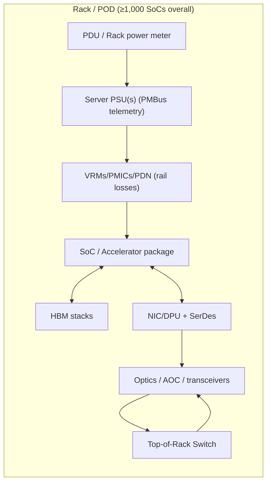
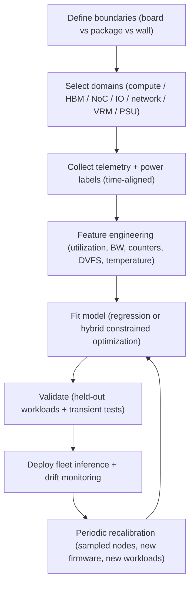

# Dynamic Power Modeling for Large-Scale AI Inference Systems at the Thousand-SoC Scale

## Executive summary

Reliable dynamic power modeling for inference fleets at or above 1,000 SoCs is best approached as a **hierarchical, telemetry-driven accounting problem** rather than a single “perfect” chip model: (a) **device/package** (compute + HBM/DRAM I/O), (b) **node-level power delivery** (VRMs/PMICs/PDN), and (c) **fabric + shared infrastructure** (NICs/switches/optics and PSU/PDU aggregation). This structure matches what is observable in production (board sensors, PMBus/Redfish, limited per-domain counters) and what is stable across generations. citeturn2search1turn2search0turn0search10turn9view0

Across accelerators, the most consistently “reliable and effective” dynamic modeling pattern in the literature is **hybrid analytic + regression calibration**: assume power is the sum of (i) a temperature/voltage-dependent **static baseline**, (ii) **activity-proportional dynamic terms** derived from counters/utilization, and (iii) **DVFS scaling** terms; then fit coefficients using constrained regression/optimization to match measured board power. This is the same core idea behind cycle-level, componentized models such as GPUWattch and later updates that re-fit coefficients to modern designs, where accuracy depends strongly on “being trained for the target generation.” citeturn8view1turn8view4turn7view0

As an accuracy anchor: GPUWattch reported average errors ≈9.9% and 13.4% on the two GPUs it was validated on, but later work showed that applying that same methodology naively to newer architectures can produce extremely large errors; an updated framework (AccelWattch) reported device-level MAPE about 7.5–9.2% on a Volta-class GPU (variant-dependent) and also quantified that mis-targeting can explode error. citeturn8view1turn8view4turn7view0

For production telemetry, onboard GPU power readings are widely used but have **non-trivial caveats**: they may be averaged over windows, update at discrete rates, and have non-negligible error; one comprehensive study reports the error behaves more like ~5% (not a flat ±5 W) and that sampling/averaging behavior can distort transient interpretation. citeturn9view0turn9view1turn0search10

High-bandwidth memory energy is often a first-order term for inference chips: published HBM2 analyses attribute several pJ/bit to internal datapath movement plus activation, and experimental work shows undervolting changes HBM power materially (while interacting with reliability guardbands). These results motivate treating HBM as its **own modeled domain** rather than folding it into a generic “memory” coefficient. citeturn18view0turn18view1

Network “cables” are usually negligible **unless they are active** (AOC/optical modules/retimers) or you are counting at megawatt scale. Module datasheets routinely show single transceivers at ~4–12 W (and sometimes higher), which becomes tens of kilowatts in large fabrics; passive copper cable itself is effectively zero-power but changes which PHY/optics power terms apply. citeturn5search2turn5search3turn5search11turn20view0turn16search1

Unspecified inputs in your request that materially affect design choices:
- **Target accelerator microarchitecture** (e.g., systolic array + SRAM vs SIMT + caches) is **unspecified**; this report provides mapping rules and two implementation options: **black-box (counter regression)** and **white-box (functional-unit decomposition)**. citeturn7view0turn4search2turn4search6  
- **Measurement budget / permissible instrumentation invasiveness** is **unspecified**; this report provides tiered instrumentation plans from “telemetry-only” to “instrumented rails + external meters.” citeturn2search0turn2search6turn2search1turn9view0

## System decomposition and power domains to model

A large inference deployment (≥1,000 SoCs) is best decomposed into **power domains aligned to both physics (where energy is dissipated) and observability (what you can measure at scale)**. Architectural-level power frameworks historically emphasize decomposing a chip into major structures and associating each with activity counts; this is exactly the design intent of early architectural power tooling and its successors. citeturn13view0turn13view1turn8view1turn15search14

To avoid under- or double-counting, define **two parallel hierarchies**:

**Hierarchy A: Physical delivery path**  
Grid/UPS → PDU → rack PSUs → server PSUs → VRMs/PMICs → on-package rails → die blocks → memory stacks → I/O and optics.

**Hierarchy B: Logical compute path**  
Model execution (tokens/sec, batch/seq length) → kernel/layer mix → functional-unit utilization and memory traffic → rail currents and temperatures.

These hierarchies meet at measurable boundaries: PSU telemetry (often PMBus), chassis power (often Redfish), device board power (vendor API), and (if available) per-rail monitors/shunts. citeturn2search0turn2search1turn0search10turn2search6

### Core components and recommended domains

**SoC / die / package (primary modeled object for inference power)**  
Model at least the following **domains** (names are illustrative; actual rails depend on the design):

- **Compute engines**: matrix/tensor units, vector/SIMD/ALU units, special-function units. Componentized GPU models explicitly map instruction classes and microbenchmark activity to units and fit per-unit coefficients. citeturn8view1turn8view4turn7view0  
- **On-chip SRAM and caches**: register files, shared SRAM/scratchpads, L2/LLC. SRAM arrays tend to be more regular to model than heterogeneous functional units, and architectural tools commonly separate these blocks. citeturn8view0turn1search17turn7view0  
- **NoC / interconnect**: on-chip interconnect and router activity; thermal models explicitly call out that interconnect self-heating and temperature feedback matter for early-stage design. citeturn19view0turn15search14  
- **Memory controllers + PHYs to HBM/DRAM**: controller logic plus I/O; modern DRAM power tools and papers emphasize that core and interface contribute differently, motivating separate terms. citeturn1search6turn18view0turn7view0  
- **DVFS islands (V/f domains)**: separate voltage/frequency domains must be explicit in the model; updated GPU power modeling work identifies missing DVFS modeling as a key error source when moving between generations. citeturn7view2turn8view4  
- **Temperature-dependent static/leakage**: thermal tooling highlights leakage increases strongly with temperature and that temperature also affects resistance/IR drop and timing. citeturn19view0

**HBM stacks (or stacked DRAM in-package)**  
Treat HBM as a **separate subsystem**, with domains roughly:

- **Core/array operations** (activation/precharge/refresh)  
- **Internal datapath movement** (mat-to-TSV, TSV-to-I/O)  
- **Interface/I/O signaling** (interposer wires, PHY energy)

Representative published values show that datapath switching energy and activation together can be several pJ/bit for HBM2-class access, and proceedings report interposer I/O energy as its own term. citeturn18view0turn1search6  
Experimental undervolting work demonstrates HBM power is materially sensitive to supply voltage guardbands, underscoring why modeling must include V and temperature (and potentially reliability constraints). citeturn18view1

**Network devices (node + fabric)**  
At ≥1,000 SoCs, even “small” per-port numbers accumulate; model:

- **NIC/SuperNIC/DPU silicon** (baseline + traffic-related terms)  
- **Transceivers/optics or active copper modules** (often quasi-constant per port)  
- **Top-of-rack and spine switches** (baseline + port population + optics)

Vendor switch specifications can vary dramatically depending on whether optics/active cables are present; one NDR-class switch spec explicitly distinguishes typical power with passive cables vs max with active cables. citeturn16search1turn11search2  
NIC datasheets and specs show that “board power with passive cables” differs from “with active modules,” sometimes even providing an explicit adjustment formula. citeturn20view0turn11search0

**Power delivery/onboard components**  
To convert “silicon power” into “wall power” (or to model node power from internal rails), model:

- **PSU efficiency and telemetry**: at minimum, a load-dependent efficiency curve; modern server efficiency programs define minimum efficiencies at multiple load points. citeturn6search8turn2search3  
- **VRM/multiphase converters**: per-rail efficiency, plus telemetry when available via PMBus/AVS mechanisms; modern multiphase design notes describe the multiphase topology and how it is configured/validated. citeturn6search9turn6search10turn2search0  
- **PCB/connector resistive losses**: I²R losses on high-current rails are small per board but can matter for tight error budgets and thermal hot spots; thermal literature highlights increasing resistivity with temperature and IR-drop impacts. citeturn19view0

**Interconnects/cables**  
Treat “cables” as three different cases:
- **Passive copper cable**: ≈0 W itself, but may constrain PHY mode/encoding and hence NIC/SerDes power. citeturn20view0turn5search9  
- **Optical transceiver modules**: explicit W/module from datasheets; often the dominant “cable-related” power. citeturn5search2turn5search3turn5search11  
- **Active copper cables / retimers**: effectively “modules on a cable,” must be counted as powered elements; some vendor specs treat them as “active module power” add-ons. citeturn20view0turn16search1



image_group{"layout":"carousel","aspect_ratio":"16:9","query":["HBM stack on interposer diagram","GPU server motherboard VRM multiphase closeup","top of rack switch QSFP OSFP ports photo","current shunt resistor sense circuit on PCB"] ,"num_per_query":1}

## Modeling approaches for dynamic power

Dynamic inference power models fall into three pragmatic categories: **first-principles analytic**, **regression/statistical**, and **hybrid analytic+regression**. The most effective approach at ≥1,000 SoCs is usually hybrid: analytic structure for portability + regression calibration for realism under proprietary microarchitectures and incomplete counters. citeturn7view0turn8view1turn3search0

### First-principles analytic models

At the block level, the standard decomposition is:

\[
P(t) = P_{\text{static}}(V,T) + P_{\text{dynamic}}(V,f,\text{activity}) + P_{\text{short-circuit}}(V,f,\text{slew})
\]

Architectural tools focus on estimating dynamic and leakage terms by associating **activity counts** with structures; this philosophy is explicit in classical architectural-level power work. citeturn13view0turn13view1turn19view0

A common dynamic approximation (per domain \(d\)):

\[
P_{\text{dyn},d}(t) \approx \alpha_d(t)\, C_{\text{eff},d}\, V_d(t)^2\, f_d(t)
\]

and leakage/temperature coupling is critical: compact thermal modeling work highlights that leakage escalates due to exponential subthreshold current dependence on temperature and that temperature affects interconnect resistivity (hence PDN losses and timing). citeturn19view0

**Memory (HBM/DRAM) analytic models** are often **command-level energy accounting**:

\[
E_{\text{mem}} = \sum_{c \in \{\text{ACT, PRE, RD, WR, REF,...}\}} N_c \cdot E_c \;+\; E_{\text{I/O}}
\]

Open DRAM power tooling explicitly exists to estimate DRAM power/energy from traces/commands, and recent work discusses modeling both core and interface power for modern DRAM generations. citeturn1search18turn1search6turn1search22  
For HBM2-class stacks, published analyses break down energy per bit into datapath switching, activation, and interposer I/O, yielding totals on the order of several pJ/bit. citeturn18view0

**Network analytic models** are usually an “energy profile” form: baseline chassis + per-port provisioning + optional traffic-dependent component; academic work on network element energy profiles commonly uses simplified functions (often linear) over configuration/traffic. citeturn5search9turn5search1

### Regression / statistical models calibrated from measurements

Regression models treat the chip/device as a partially observed system:

\[
P(t) \approx \beta_0 + \sum_i \beta_i\, x_i(t)
\]

where \(x_i\) are measured signals such as utilization, instruction mixes, memory throughput, cache misses, or vendor-specific counters. A representative early GPU approach trained linear regressions using GPU performance counters as features and physical power measurements as labels. citeturn3search0turn3search7  
Later work used machine learning to predict GPU performance and power from measured real hardware across configurations, motivated by the need to explore design spaces and DVFS options. citeturn3search4

Key practical regression choices for inference systems:

- **DVFS-aware modeling**: either fit separate coefficients per \((V,f)\) state or include \(V^2 f\) scaling factors explicitly; modern GPU power modeling work identifies DVFS modeling as crucial for accuracy when migrating across generations. citeturn7view2turn8view4  
- **Time alignment and sampling**: onboard power readings can be averaged/aliased; NVML-based power sampling has been reported at ~62.5 Hz in practice, but interpretation can be non-trivial and validity depends on update behavior. citeturn9view1turn9view0turn0search10  
- **Regularization and feature selection**: correlate and prune counters (many are collinear) to avoid unstable coefficients; recent data-driven PMC methodologies emphasize selecting counters with strongest correlation per DVFS state. citeturn3search19turn10search9

### Hybrid analytic + regression (recommended default)

Hybrid models keep an analytic decomposition but calibrate parameters to real measurements. A modern example is AccelWattch: it collects per-component activity (from simulation and/or hardware counters) and uses optimization to fit scaling factors so modeled power matches measured hardware power while preserving a componentized structure. citeturn7view0turn8view4

A generic hybrid form:

\[
P(t) = P_{\text{idle}}(V,T) + \sum_{k=1}^{K} s_k \cdot \hat{P}_k(t)
\]

where \(\hat{P}_k\) are analytic sub-model outputs (e.g., “tensor unit dynamic,” “NoC dynamic,” “HBM controller dynamic”), and \(s_k\) are fitted scalars (or small param sets) solved via constrained least squares / quadratic programming. AccelWattch explicitly describes iterative optimization to minimize relative error against measured hardware power. citeturn8view4turn7view0

### Comparison table

| Model type | Typical inputs | Outputs & granularity | Pros | Cons | Best use cases |
|---|---|---|---|---|---|
| First-principles analytic | V/f/temperature; activity factors; architectural parameters; memory command traces | Per-block power; interpretable breakdown | Portable structure; extrapolates to unseen workloads | Hard to parameterize on proprietary chips; can drift across generations | Early design space exploration; “what-if” analysis; counterfactual DVFS scenarios |
| Regression/statistical | Board power labels; utilization/perf counters; workload metrics (tokens/s, batch, seq length) | Accurate device power within trained space | Low deployment cost; works without microarch detail | Can fail under distribution shift; less interpretable | Fleet monitoring and accounting; fast per-second prediction |
| Hybrid analytic+regression | Combination of the above; component activities + measurements | Component breakdown + calibrated totals | Best accuracy/portability trade-off; supports partial observability | Requires calibration datasets and careful validation | Production-grade modeling; cross-generation maintenance; detailed attribution |

This table reflects patterns in architectural modeling (activity-based decomposition), GPU power modeling evolution (from GPUWattch to newer calibrated models), and performance-counter-driven regression methods. citeturn13view0turn8view1turn8view4turn3search0turn3search4

## Adapting GPU-based models to custom accelerators

Your request specifically asks how to adapt “GPU-based models” to TPU-like custom accelerators. The high-level answer is: **preserve the additive structure**, but **redefine the component map and observability signals** to match the accelerator’s functional units and compiler/runtime metrics. The necessary utilization signals for TPU-like systems are explicitly surfaced in official profiling/monitoring stacks (e.g., FLOPS utilization, duty cycle, memory bandwidth utilization). citeturn4search6turn4search0turn4search10

### Functional-unit mapping

GPU-centered component models (GPUWattch/AccelWattch style) assume you can map activity to units like ALU/FP/tensor core, caches, NoC, and DRAM/MC, then fit coefficients. AccelWattch explicitly builds such a component mapping and uses microbenchmarks to exercise categories and fit scaling factors. citeturn7view0turn8view4

A TPU-like accelerator typically has:
- **Matrix Unit (systolic array / MXU)** as dominant compute block. Official architecture docs describe MXU size and per-cycle MAC capability, which can be used to compute “theoretical peak” and define FLOPs utilization. citeturn4search2turn4search10turn4search9  
- **Vector and scalar units** for non-matmul ops, reductions, indexing, etc. Official TPU v4 docs enumerate vector and scalar units alongside MXUs. citeturn4search9turn4search2  
- **On-chip memory hierarchy** (vector memory / common memory / SRAM structures) and **HBM**. Monitoring docs expose memory bandwidth utilization as an explicit metric (v4+). citeturn4search0turn4search7  
- **Interconnect (on-chip + pod/slice fabric)**: performance tooling reports duty cycle, goodput, and efficiency metrics that help separate “device busy” vs “stalled on comms.” citeturn4search6turn4search10

Practical mapping rule: define a component vector \(k\) where each component has (i) a utilization signal, (ii) a throughput proxy, or (iii) an instruction/event count. For TPU-like devices, a minimal mapping often works with:
- \(u_{\text{mxu}}\): FLOPs utilization or matrix unit busy fraction  
- \(u_{\text{vec}}\): vector/scalar busy fraction (or “duty cycle minus mxu busy,” if only aggregate is available)  
- \(b_{\text{hbm}}\): memory bandwidth utilization (or bytes/s)  
- \(u_{\text{noc}}\): inferred from stall times, collective ops time, or interconnect counters (tool-dependent)  

These utilization/efficiency metrics are directly supported by TPU performance tooling and monitoring (e.g., FLOPs utilization, TPU duty cycle, memory bandwidth utilization, MFU). citeturn4search6turn4search0turn4search10turn4search7

### Scaling rules and DVFS adaptation

When adapting a GPU-trained model to a different accelerator family, avoid “frequency-only” scaling. Updated GPU modeling work explicitly notes that missing DVFS modeling causes large inaccuracies when moving to newer architectures; the same risk applies when porting to custom accelerators. citeturn7view2turn8view4

Recommended scaling structure (per domain \(d\)):

\[
P_d(t) = P_{\text{static},d}(T,V_d) + \left(V_d(t)^2 f_d(t)\right)\cdot \sum_i \theta_{d,i} \cdot \phi_{d,i}(t)
\]

where \(\phi_{d,i}\) are normalized activity features (e.g., “mxu busy fraction,” “HBM bytes per cycle,” “NoC flit rate”), and \(\theta_{d,i}\) are fitted coefficients. This keeps physical scaling explicit and makes coefficients more transferable across DVFS points. The need to explicitly model DVFS and to calibrate coefficients with measured power is central in modern GPU power modeling updates. citeturn8view4turn7view0turn19view0

If the target accelerator has limited DVFS exposure (common in some inference ASICs), you still need to model **effective voltage droop and temperature drift** as perturbations to \(P_{\text{static}}\) and to the effective “\(V^2 f\)” factor; thermal modeling literature emphasizes that temperature impacts leakage and resistivity, so static power is not constant even at fixed clocks. citeturn19view0

### Two adaptation options depending on what is “unspecified”

Because your target accelerator microarchitecture is **unspecified**, choose one of two paths:

**Option A: Black-box counter regression (lowest dependency on microarchitecture disclosures)**  
1) Collect board/package power \(P\) (onboard sensor or external) and a feature vector \(x(t)\) from profiler/monitoring metrics (FLOPs util, duty cycle, memory bandwidth util, token rate). citeturn4search6turn4search0turn4search7turn9view0  
2) Fit a DVFS-aware regression (or separate models per operating state). citeturn3search0turn3search19turn7view2  
3) Add a separate memory/IO term if HBM power is not well explained by compute utilization (common). citeturn18view0turn1search18

**Option B: White-box functional-unit decomposition (best attribution, requires microbench access)**  
1) Define unit categories (MXU, vector/scalar, SRAM, NoC, HBM ctrl/PHY). citeturn4search2turn4search9turn19view0  
2) Create microbenchmarks or synthetic kernels that isolate each unit’s activity; GPU power modeling frameworks do this explicitly to bound uncertainties and fit coefficients. citeturn8view1turn7view0  
3) Fit coefficients with constrained optimization so each component remains non-negative and total matches measured power. citeturn8view4turn7view0

## Data requirements and measurement methodology

Dynamic modeling is only as good as the measurement chain. At ≥1,000 SoCs, you must simultaneously solve: **(i) sensor correctness, (ii) sampling/aliasing, (iii) time alignment, and (iv) per-domain observability.** The literature on onboard GPU sensors shows these are not “details”—they directly determine error bars and transient validity. citeturn9view0turn9view1turn0search10

### Telemetry sources by domain

**Device/package power (accelerator board power)**  
- Many operators use the device management library exposed by the GPU vendor; official documentation states it is also the underlying library for the standard CLI tool. citeturn0search10turn0search14  
- Caveat: a comprehensive study reports power readings may be averaged and that error behaves like a percentage; this affects model label quality and dynamic validation. citeturn9view0

**CPU/package energy (host)**  
- RAPL-like interfaces expose energy counters; an official advisory documents that RAPL energy information updates at ~1 ms and counters can be read via MSRs/MMIO. citeturn10search13turn10search6  
- External power measurement studies note domain mismatch: external measurements at VR input include additional board components not included in RAPL domains, so offsets are expected even if each is “correct” in its own domain. citeturn10search15turn10search21

**Chassis / system power**  
- Redfish defines how to represent consumed chassis power and provides a telemetry framework and metric definitions (useful for standardizing cross-vendor collection). citeturn2search1turn2search13

**PSU and VRM telemetry**  
- PMBus is the dominant standard for power system management telemetry; its implementer forum publishes current specification revision status and notes its relationship to SMBus. citeturn2search0turn2search4  
- Open-source BMC stacks often integrate PSU monitoring documents/workflows based on PMBus. citeturn2search3turn2search7  
- For direct rail instrumentation, current-shunt/power-monitor ICs provide shunt + bus voltage measurement and direct current/power readouts over SMBus/I²C. citeturn2search6turn2search2

**TPU-like accelerator utilization metrics**  
- Official monitoring documents expose memory bandwidth utilization as a ratio of used to maximum bandwidth over a sample period (v4+), and tooling enumerates summary metrics such as FLOPs utilization and duty cycle. citeturn4search0turn4search6turn4search7

### Sampling rates and synchronization

Sampling rate must match your objective:

- **For energy accounting, cost attribution, and capacity planning**: 1 Hz to a few Hz is usually sufficient if you integrate energy over seconds to minutes; TPU monitoring libraries explicitly sample metrics every second (1 Hz). citeturn4search7turn2search1  
- **For runtime control loops (DVFS/power capping/scheduling)**: 5–50 Hz is often used, but onboard sensors may have fixed update periods and averaging windows; NVML-based sampling has been reported around ~62.5 Hz in practice, and improper interpretation can bias results. citeturn9view1turn9view0  
- **For power delivery and transient validation** (VRM stress, droop, thermal design): kHz–MHz external instruments are required; onboard sensors are not sufficient to capture switching transients and fast steps. This distinction is explicit in papers that use high-rate external measurement to study energy between scheduling events. citeturn10search15turn9view0

Time alignment requirements:

- Align **power labels** and **activity features** on a common timeline. Onboard power readings can reflect a prior averaging window; the GPU sensor study explicitly discusses aliasing effects and that users cannot synchronize the window start to workload start. citeturn9view0  
- For cluster-scale aggregation, standardize metric naming and semantics via Redfish telemetry definitions where possible. citeturn2search1turn2search5

### Practical instrumentation tiers (when budget is unspecified)

Because measurement budget is **unspecified**, the most practical recommendation is a tiered plan:

**Tier 0: Telemetry only (lowest cost, fastest rollout)**  
- Device board power via vendor API  
- Host energy via RAPL-like counters  
- Chassis power via Redfish (if available)  
- PSU power via PMBus (if exposed via BMC)

This is scalable but yields limited per-rail attribution and relies heavily on onboard sensor correctness. citeturn0search10turn10search13turn2search1turn2search0turn9view0

**Tier 1: Add per-rail monitors on representative nodes**  
Instrument a small statistically representative sample (e.g., 1–2 racks or 1–5% of nodes) with shunt monitors on major rails (HBM rail, core rail, SerDes rail). This provides calibration anchors for separating compute vs memory vs IO. citeturn2search6turn18view1turn19view0

**Tier 2: External lab-grade validation for transients**  
Use high-speed external measurements on a few nodes to validate step response and to characterize VRM losses, then fold these parameters into fleet-wide models. This is the approach used in rigorous onboard sensor validation work. citeturn9view0turn10search15

## Model structures, parameter estimation, and validation

This section provides **concrete model structures and equations** that are implementable at fleet scale, plus calibration and validation strategies.

### Component-level model templates

#### Accelerator package (compute + on-chip memory + NoC)

A robust and scalable structure is **additive with explicit DVFS scaling**:

\[
P_{\text{pkg}}(t) = P_{\text{leak}}(T,V) + P_{\text{uncore}}(V,f) + \sum_{u \in \mathcal{U}} \left(V_u(t)^2 f_u(t)\right)\cdot \left(\theta_u^\top \phi_u(t)\right)
\]

- \(\mathcal{U}\): functional-unit groups (e.g., tensor/matrix, vector/scalar, SRAM/caches, NoC).  
- \(\phi_u(t)\): normalized utilization/counter features for unit \(u\).  
- \(\theta_u\): fitted coefficients (energy per “unit activity per cycle,” scaled appropriately).

This matches the philosophy of architectural component models and the explicit component-category activity mapping used in modern GPU power modeling frameworks. citeturn13view1turn7view0turn8view4

#### HBM stacks (command + bandwidth driven)

Two practical modeling options:

**HBM Option 1: Trace/command-based energy (best when you have controller traces)**  
Use DRAMPower-like command accounting:

\[
P_{\text{HBM}}(t) = \frac{1}{\Delta t}\sum_c N_c(t)\,E_c(V,T) + k_{\text{io}}\cdot \text{BW}(t) + P_{\text{idle}}(V,T)
\]

DRAMPower explicitly exists as an open DRAM power/energy estimator, and newer work discusses modeling both core and interface power for current DRAM generations. citeturn1search18turn1search6turn1search22

**HBM Option 2: Bandwidth + activation proxy (best when you only have BW/utilization)**  
Approximate:

\[
P_{\text{HBM}}(t) \approx P_{\text{idle}} + a\cdot \text{BW}(t) + b\cdot \text{ACT\_rate}(t)
\]

Published HBM2 analysis shows datapath switching and activation energy are both significant contributors, supporting a two-term structure (BW-like + activation-like). citeturn18view0turn18view1

#### Power delivery (VRMs/PMICs/PDN)

Convert rail power to upstream power with efficiency and resistive loss terms:

\[
P_{\text{in}} = \frac{P_{\text{out}}}{\eta(I,V,T)} + I^2 R_{\text{PDN}}(T)
\]

Multiphase converter design notes describe that a multiphase buck is a parallel set of power stages and is designed/validated with explicit specs (enabling empirical estimation of \(\eta\) and effective resistances). citeturn6search9turn19view0  
Digital controllers commonly expose PMBus/AVS-style programmability/telemetry used to read operating points. citeturn6search10turn2search0

#### Network switches, NICs, and optics

Use an “energy profile” model:

\[
P_{\text{switch}} = P_{\text{chassis}} + \sum_{p \in \text{ports}} \left(P_{\text{port,base}} + P_{\text{xcvr}}(p) + k_p \cdot \text{throughput}_p\right)
\]

Academic network energy profiling work and EEE switch modeling both support configuration+traffic dependent power models derived from standards/measurements. citeturn5search9turn5search1turn5search5  
Vendor specs show that the same switch can have very different typical vs max power depending on whether passive or active cables are present, reinforcing the need to model optics/modules explicitly. citeturn16search1turn16search13

### Parameter estimation procedures

A production-appropriate calibration flow is multi-stage.

**Stage 1: Normalize and clean telemetry**  
- Convert all energy counters to power over \(\Delta t\) with consistent units.  
- Remove impossible values (negative power, readings outside rails).  
- Apply time alignment and account for averaging windows when available; sensor validation work highlights that the averaging window can be a fraction of update period and can alias with workload periodicity. citeturn9view0turn10search13

**Stage 2: Fit per-device models (device type × firmware/driver × DVFS regime)**  
- Use constrained linear regression or ridge regression: \(P = \beta_0 + \beta^\top x\), with constraints \(\beta_i \ge 0\) for energy-like features.  
- For hybrid models, fit scaling factors \(s_k\) on analytic components via quadratic programming; modern GPU power modeling explicitly describes fitting per-component scaling factors to minimize relative error against measurements. citeturn8view4turn7view0

**Stage 3: Cross-domain reconciliation (avoid double counting)**  
- Ensure the device model predicts **DC power at the device boundary** you measure (e.g., board power sensor) and treat VRM/PSU as separate conversions.  
- External vs internal measurement mismatch is expected; RAPL studies explicitly note external measurements include more components than RAPL domains, producing offsets. citeturn10search15turn2search1turn2search0

**Stage 4: Fleet-wide calibration using aggregation constraints**  
At rack or row level, enforce:

\[
\sum_{n \in \text{nodes}} \hat{P}_n(t) + \hat{P}_{\text{switches}}(t) \approx P_{\text{rack meter}}(t)
\]

and allocate residuals by confidence (e.g., trust rack meter > PSU telemetry > device sensor). Large-scale modeling papers in other contexts (e.g., ML fleet efficiency analysis) motivate fleet-level aggregation/efficiency frameworks, and Redfish telemetry standards enable consistent chassis power reporting. citeturn2search1turn4search17turn5search8

### Validation strategies

Use **two validation levels**: *component fidelity* and *system fidelity*.

**Component fidelity validation**  
- Validate \(P_{\text{pkg}}\) against onboard board power on held-out workloads (ideally different layer mixes than training).  
- For component attribution, use microbench isolation approach (as in GPUWattch/AccelWattch) to ensure coefficients map to the intended hardware unit. GPUWattch explicitly describes a large microbenchmark suite to bound modeling uncertainties and validates total power error as a proxy when the targeted component dominates. citeturn8view0turn8view1turn7view0

**System fidelity validation**  
- Validate at PSU input and rack meter; expect systematic offsets if your device boundary differs.  
- Validate time response separately: onboard GPU power sensors may be averaged; the nvidia-smi study uses transient tests and shows interpretation pitfalls. citeturn9view0turn10search15

**Accuracy targets and what is realistic**  
- Architectural component models trained for a specific GPU generation report ~7.5–9.2% MAPE device-level depending on variant, with some kernels higher; GPUWattch reported ~9.9–13.4% average error on its trained devices. citeturn8view4turn8view1  
- If your labels are onboard GPU sensors, sensor error itself can be ~percent-level and may not be “±5 W”; this sets a floor on achievable regression accuracy unless externally calibrated. citeturn9view0  
- For HBM and memory subsystems, published per-bit energy and undervolting sensitivity imply that ignoring voltage/thermal dependence can introduce systematic errors under changing thermal conditions or guardband adjustments. citeturn18view0turn18view1turn19view0



## Network cables and other “hidden” power terms

### What “cable power” usually means in AI fabrics

In practice, “cable power” is almost never dissipation in the copper/fiber conductor itself; it is primarily:
- **Optical transceiver module power** (OSFP/QSFP families)  
- **Active copper cable electronics** (retimers/equalizers)  
- **SerDes/PHY power changes forced by reach/BER requirements**

Vendor and third-party transceiver datasheets provide explicit module power: examples include QSFP28 modules with max power consumption around 4.5 W and OSFP 400G modules with power figures around 12 W (often stated directly). citeturn5search2turn5search3turn5search7  
A vendor OSFP module document shows different typical/max power depending on mode (e.g., 400Gb/s mode ~8 W typical / 9 W max in one spec). citeturn5search11

### When to include or exclude cable/optics in modeling

**Exclude (or treat as constant) when**:
- Links use **passive copper cables** and you are not doing fine-grained NIC thermal modeling. Some NIC specs explicitly separate “typical power with passive cables,” implying the passive cable itself is not a power consumer. citeturn20view0turn11search0  
- You only need ±5–10% cluster power accuracy and optics population is stable across your fleet.

**Include explicitly when**:
- You use **pluggable optics or active cables** at scale. Switch specs can vary from “typical with passive cables” to a much higher “max with active cables,” directly indicating optics/cables materially change power. citeturn16search1turn11search2  
- Your fabric is large enough that transceivers are a first-order term. Example: 2,000 OSFP modules × 8 W typical ≈ 16 kW; 10,000 modules × 8–12 W ≈ 80–120 kW, which is no longer negligible in rack- or pod-level accounting. Those per-module numbers are consistent with published module datasheets. citeturn5search11turn5search3  
- You are modeling “node vs network” attribution, because optics power is often assigned to NICs/switches rather than to “the cable.” citeturn5search9turn16search13

**Special case: active modules on NICs**  
Some vendor specs provide explicit formulas to add “active module power” to the NIC’s thermal/power figure when active cables/optics are used, reinforcing that you should treat optics as additive components (with an efficiency factor). citeturn20view0

### Major uncertainty sources and calibration procedures

At ≥1,000 SoCs, power model uncertainty usually comes from five sources:

1) **Sensor error and semantics**: onboard GPU sensors may publish averaged values and have percentage-like error; external validation is required for tight SLAs. citeturn9view0  
2) **Time misalignment / averaging windows**: aliasing between periodic workloads and update periods can bias regression features and validation, as shown by transient sensor studies. citeturn9view0  
3) **Domain mismatch**: RAPL vs external VR input vs PSU input all represent different boundaries; offsets are expected. citeturn10search15turn10search21  
4) **Temperature drift and leakage**: thermal modeling literature highlights leakage/ resistive impacts; ignoring temperature can cause day/night, seasonal, or cooling-mode biases. citeturn19view0  
5) **Distribution shift in workload mix**: inference changes (new models, longer context, different batching) alter compute/memory ratios; hybrid models mitigate this by separating compute vs memory vs IO vs network terms. citeturn18view0turn4search10turn7view0

Recommended calibration procedure for fleet reliability:
- Calibrate per device type quarterly (or on driver/firmware changes).  
- Maintain a small, permanently instrumented “golden rack” with external meters + per-rail monitors to detect drift and re-baseline onboard sensors. Sensor validation work emphasizes that hidden measurement mechanisms can otherwise surprise downstream research/operations. citeturn9view0turn2search6turn2search1

## Implementation guidance for scalability beyond 1,000 SoCs

### Architecture for computation and data volume

A scalable implementation typically uses:
- **Per-node agent**: collects device power, utilization/counters, temperature, DVFS state, and NIC/optics inventory.  
- **Fabric agent**: collects switch power and optics inventory; vendor switch specs show optics/cable population changes power materially, so inventory matters. citeturn16search1turn16search13  
- **BMC/out-of-band collector**: polls PSU/chassis power via PMBus/Redfish; standards docs explicitly define these telemetry mechanisms. citeturn2search0turn2search1turn2search3  
- **Central stream processor**: runs models, aggregates, and enforces rack-level reconciliation constraints.

Computational cost is not the bottleneck; the bottleneck is telemetry transport and correctness. A linear or small generalized-linear model with ~50 features costs O(50) ops per sample. At 1 Hz × 1,000 nodes, that’s ~50k multiplications/sec—trivial—while telemetry ingestion and time alignment dominate. The need to reason about sensor update rates and averaging is demonstrated in onboard measurement studies. citeturn9view0turn4search7turn2search1

### Recommended “default” model stack for production

1) **Device model (hybrid)**:  
   \[
   \hat{P}_{\text{board}} = \hat{P}_{\text{idle}}(T) + a\cdot u_{\text{compute}} + b\cdot \text{BW}_{\text{HBM}} + c\cdot u_{\text{IO}} + d\cdot u_{\text{NoC}}
   \]  
   where \(u_{\text{compute}}\) is FLOPs utilization/duty cycle and \(\text{BW}_{\text{HBM}}\) is memory bandwidth utilization. This mirrors the componentized approach in modern GPU power models while remaining implementable with TPU-like metrics. citeturn7view0turn8view4turn4search6turn4search0  

2) **Power delivery correction**: apply VRM efficiency and PDN losses to convert “rail-level estimates” to upstream board/PSU power when you need wall-power attribution. Use PMBus/Redfish/rail monitors when available. citeturn2search0turn2search6turn2search1turn6search10  

3) **Network/optics model**: count optics/modules explicitly using inventory; treat passive cables as zero-power; add per-port module watts from datasheets; model switch baseline from vendor spec. citeturn5search3turn5search2turn16search1turn20view0  

4) **Reconciliation layer**: enforce rack-meter consistency and allocate residuals based on trust hierarchy (rack meter > PSU telemetry > device sensor). Redfish and PMBus provide the telemetry primitives for this. citeturn2search1turn2search0turn2search3

### Example measurement scripts and artifacts

Below are minimal examples you can adapt. (These are illustrative; your environment will dictate permissions and device names.)

**GPU board power via NVML (Python)**  
```python
# Requires NVIDIA driver + NVML bindings (e.g., pynvml).
# NVML is the underlying library for the vendor CLI tool. (See NVML docs.)
import time
from pynvml import nvmlInit, nvmlDeviceGetHandleByIndex, nvmlDeviceGetPowerUsage

nvmlInit()
h = nvmlDeviceGetHandleByIndex(0)

while True:
    # milliwatts
    p_mw = nvmlDeviceGetPowerUsage(h)
    print(time.time(), p_mw / 1000.0)  # watts
    time.sleep(0.2)  # adjust; beware sensor update/averaging behavior
```
NVML is documented as the programmatic interface underlying the standard GPU management CLI. citeturn0search10turn0search14turn9view0

**CPU package energy via RAPL MSRs (Linux, conceptual C-like pseudo)**  
```c
// Read MSR_PKG_ENERGY_STATUS periodically; convert using energy units MSR.
// RAPL energy updates ~1ms; counters are energy since boot.
```
Official documentation notes ~1 ms update behavior for RAPL energy reporting (with access via MSR/MMIO). citeturn10search13turn10search6

For reference implementations: open-source tools exist that read RAPL MSRs and export time series, including code examples and a “RAPL tool” that polls energy via PAPI. citeturn0search11turn0search23turn10search17

**PMBus rail/PSU telemetry (conceptual)**  
PMBus specification status and ecosystem documentation describe using PMBus/SMBus to query voltage/current/power and to manage power devices. citeturn2search0turn2search16turn2search3  
For rail-level sensing, shunt monitors expose current and power via SMBus/I²C, enabling per-rail dynamic model labels and calibration. citeturn2search6turn2search2

### Prioritized sources used in this report

Primary/official interfaces and telemetry:
- Vendor GPU management API documentation (NVML) describing power reporting and its relationship to the standard CLI tool. citeturn0search10turn0search14  
- RAPL update-rate and access semantics from an official advisory. citeturn10search13turn10search6  
- Redfish telemetry and chassis power semantics documentation. citeturn2search1turn2search13  
- PMBus specification status from the implementer forum; ecosystem usage in BMC/PSU monitoring documents. citeturn2search0turn2search3turn2search7  
- Official TPU monitoring/profiling docs describing memory bandwidth utilization and performance summary metrics (FLOPs utilization, duty cycle, MFU). citeturn4search0turn4search6turn4search10turn4search8

Key academic/technical modeling references:
- Architectural-level activity-based power modeling foundation (Wattch screenshots show “parameterizable power models” and cycle-level resource usage counts). citeturn13view0turn13view1  
- GPUWattch validation errors on trained architectures and methodology. citeturn8view1turn8view0  
- AccelWattch modern GPU modeling and reported MAPEs; explicit mention of DVFS as critical and use of optimization to fit scaling factors. citeturn7view0turn8view4  
- Onboard GPU power sensor interpretation and error characterization (nvidia-smi/NVML). citeturn9view0turn9view1  
- HBM energy and sensitivity evidence: pJ/bit breakdown for HBM2 and undervolting effects on real HBM chips. citeturn18view0turn18view1  
- HotSpot thermal modeling and explicit statements about temperature impacts on leakage and interconnect resistivity. citeturn19view0  
- Open DRAM power tool and recent DRAM modeling work. citeturn1search18turn1search6turn1search22  
- Network energy modeling references for energy profiles and traffic-dependent models (EEE switch modeling). citeturn5search9turn5search1turn5search5

Network equipment and optics datasheets/specs (for explicit watts):
- NDR-class switch power specs distinguishing passive vs active/optical cabling cases. citeturn16search1turn16search13  
- NIC “passive-cable power” plus explicit adjustment formula for active modules. citeturn20view0  
- Transceiver module wattage examples (QSFP28 and OSFP). citeturn5search2turn5search3turn5search11

